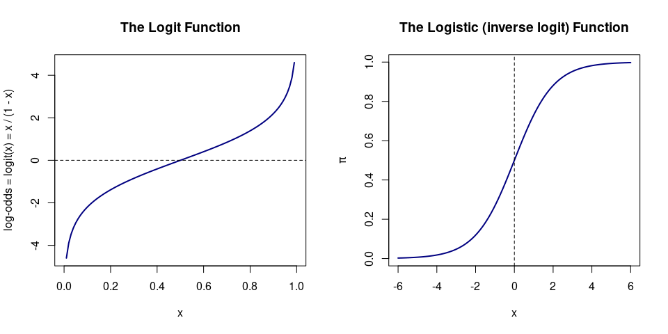

# Technical note: Logistic Regresstion
Stu Field
19 September 2024

## Multivariate Logistic Regression

As in univariate logistic regression, let $\pi(x)$ represent the
probability of an event that depends on $p$ covariates or independent
variables. Then, using an *inverse logit* formulation, which is simply
the inverse of log-odds, for modeling the probability, we have:

\$\$

\$\$

The form is identical to univariate logistic regression, but now with
more than one covariate.

To obtain the corresponding log-odds (*logit*) function we get:

$$
\begin{eqnarray}
  logit(\pi(X)) &=& log\bigg(\frac{\pi(X)}{1-\pi(X)}\bigg) \\
                &=& log\Bigg[\frac{\frac{e^{\beta_0+\beta_1X_1+\beta_2X_2+\dots+\beta_pX_p}}{1+e^{\beta_0+\beta_1X_1+\beta_2X_2+\dots+\beta_pX_p}}}{1-\frac{e^{\beta_0+\beta_1X_1+\beta_2X_2+\dots+\beta_pX_p}}{1+e^{\beta_0+\beta_1X_1+\beta_2X_2+\dots+\beta_pX_p}}}\Bigg] \\
                &=& log\Bigg[\frac{\frac{e^{\beta_0+\beta_1X_1+\beta_2X_2+\dots+\beta_pX_p}}{1+e^{\beta_0+\beta_1X_1+\beta_2X_2+\dots+\beta_pX_p}}}{\frac{1}{1+e^{\beta_0+\beta_1X_1+\beta_2X_2+\dots+\beta_pX_p}}}\Bigg] \\
                &=& log\big(e^{\beta_0+\beta_1X_1+\beta_2X_2+\dots+\beta_pX_p}\big) \\
                &=& \beta_0+\beta_1X_1+\beta_2X_2+\dots+\beta_pX_p,
\end{eqnarray}
$$

which gives the log-odds defined by a standard multivariate linear
regression model. Notice that this transform changes the range of
$\pi(X)$ from $(0,1)$ to $(-\infty, +\infty)$, as is usual for linear
regression. Notice also that it is trivial to convert from log-odds to
probability via:

$$
\begin{eqnarray}
  odds &=& \frac{\pi}{1-\pi} \\
  && \\
  \pi  &=& \frac{odds}{1+odds}
\end{eqnarray}
$$

Plots of the logit (‘link’) function and its inverse, the logistic
function. The logistic function maps any value on the y-axis of the
logit function to a value on $(0, 1)$.

``` r
par(mfrow=c(1, 2L))
curve(log(x / (1 - x)), from = 0, to = 1, col = "navy", lwd = 2,
      main = "The Logit Function",
      ylab = bquote("log-odds = logit(x) = x / (1 - x)"))
abline(h = 0, lty = 2)
curve(exp(x) / (1 + exp(x)), from = -6, to = 6, col = "navy", lwd = 2,
      main = "The Logistic (inverse logit) Function",
      ylab = expression(pi))
abline(v = 0, lty = 2)
```



Similar to linear regression, and analogously to univariate logistic
regression, the above equations represent the mean or expected
probability, $\pi(X)$, given $X$.

As this is an estimate, each data point will have an error distribution,
but rather than a normal distribution (linear regression), we use a
binomial distribution, to match the dichotomous outcomes. The mean of
the binomial distribution is $\pi(X)$, and the variance is
$\pi(X)(1-\pi(X))$. Of course, now $X$ is a vector, whereas it is a
scalar value in the univariate case.

Let $\cal{L} = L$$(Data; \theta)$ be the likelihood of the data given
the model, where $\theta = {\beta_0, \beta_1,\dots,\beta_p}$ are the
parameters of the model. The parameters are estimated by the principle
of maximum likelihood. **Technical point**: there is no error term for
the overall logistic regression model, unlike in linear regressions.
