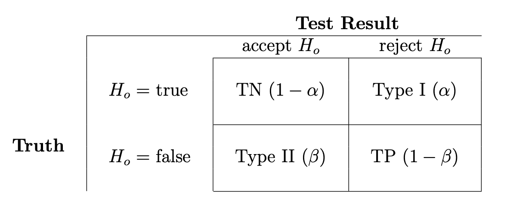

```{r setup, include = FALSE}
knitr::opts_chunk$set(
 collapse = TRUE,
 comment  = "#>"
)
plotPowerCurves <- function(effect = c(0.5, 2, 0.1),
                            power.vec = seq(0.5, 0.9, 0.1),
                            alpha = 0.05,
                            bonferroni = 1129, main = NULL) {

  mat <- sapply(power.vec, function(.b)
                sapply(effect, function(.x)
                       power.t.test(delta = .x, power = .b,
                                    sig.level = alpha / bonferroni)$n))
  dimnames(mat) <- list(sprintf("%0.2f", effect), sprintf("%0.2f", power.vec))

  if ( is.null(main) ) {
     main <- bquote("t-test Power Curves | Bonferroni corrected ("~ n == .(bonferroni)~"|"~ alpha == .(alpha))
  }

  withr::local_par(list(mar = c(4, 5, 3, 1)))
  matplot(mat, type = "l", axes = FALSE, main = main,
          cex.axis = 2, cex.lab = 2, cex.main = 2,
          xlab = "Effect Size (sd)", lwd = 1.5, lty = 1,
          ylab = "Number of Samples / Group (n)")

  grid(col = "gray50")
  matplot(mat, type = "b", lty = 1, pch = 21, bg = "gray", lwd = 1.5,
          axes = FALSE, add = TRUE, col = col_string)
  axis(1, at = seq(length(effect)), labels = effect)
  axis(2)
  box()
  legend("topright", legend = colnames(mat), col = col_string, title = "Power",
         ncol = length(power.vec) %/% length(col_string) + 1,
         lty = 1, lwd = 1.5, cex = 1.5)
  invisible(mat)
}

col_string <- c("dodgerblue", "red", "darkgreen",
                "darkorchid4", "cyan", "orange",
                "black", "grey", "#990066", "green", "#24135F")
```


---------


# Overview

Frequentist statistical methods for power and sample size are based in
hypothesis testing, typically for a single hypothesis, and rely on the
specification of parameters for specificity ($\alpha$, statistical
standard of evidence) and sensitivity ($\beta$, power). Hypothesis testing
theory recommends ``full coverage'' for tests with $\beta$ set to $1-\alpha$,
although this recommendation is rarely followed in practice even in the
context of clinical trials. The specificity parameter, $\alpha$, is
traditionally set to $0.05$ and multiple hypotheses are evaluated using
$\alpha$-spending: assigning a proportion of the total $\alpha$ to each
hypothesis based on the priority given to the test in the statistical design.
An additional parameter, the estimate of the effect size, is also required
for power and sample estimation. A basic example of effect size is the
difference between two group means in standard deviation units and requires
estimates of the group means and an estimate of the variance of the
difference between the means. 

Applying these techniques over a large number of tests with $\alpha$-spending
reduced to an application of Bonferroni methods (dividing $0.05$ by the
number of tests) results in straightforward calculation of power and
sample size estimates. A critical caveat should be noted: statistical
testing over a large number of tests is typically a hypothesis generating
exercise and fundamental assumptions in frequentist hypothesis testing
will be violated. 
Power is defined as the probability of detecting a true difference, and
is often represented by ($1-\beta$) where $\beta$ is the false negative
rate (or type II error rate). Thus,

$$
\begin{eqnarray*}
  power = 1 - \beta &=& P(reject\ H_o\ |\ H_o = false), \\
                    &=& P(reject\ H_o\ |\ H_a = true)
\end{eqnarray*}
$$

{width=75%}

Power analyses are an intricate balance between the effect size
(in the simplest 2 group comparison, the standardized difference in the means)
and the sample size. Larger effects are easier to detect and smaller effects
can become detectable by increasing the number of samples.

# Lighthouse of Power

Consider a lighthouse at night and a vessel some distance from shore.
For those on the vessel to see the lighthouse (to detect its location),
there are two options:
- decrease the distance between the vessel and the shoreline
  (increase the sample size), or 
- increase the brightness of the
  lighthouse (increase the effect size).
  
For a given off-shore distance, there is a critical threshold brightness,
below which it cannot be detected. For a given brightness, there is a
critical distance from shore beyond which it cannot be detected.


## Questions of Power

Thus, power analyses can be used answer 2 fundamentally different questions:

- what is the minimum sample size required so that one can be likely
  (95% of the time?) to detect an effect of a given size?
- what is the minimum effect size that is likely to be detected in a
  study of a given sample size?


## Sample Size Estimates

Disregarding the complexities of exploratory, hypothesis generating
experiments and forging ahead to apply frequentist power and sample size
estimation methods for a basic experiment: two independent groups,
$1$ and $2$, with equal variance using frequently calculated parameters
(e.g. $\hat{\mu}$). Some basic estimates are going to be required via
the following formulas:

Effect Size ($\delta$) Calculation:

$$
\begin{equation}
  \tag{1}
  \def \mysigma{\hat{\sigma}^2}
  \delta = \frac{\hat{\mu_1} - \hat{\mu_2}}{\sqrt{\mysigma_{p}}}
\end{equation}
$$

where $\hat{\mu_1}$ and $\hat{\mu_2}$ are the point estimates of the
arithmetic mean for groups 1 and 2 respectively, and if we assume equal
variance among the two groups, $\mysigma_{p}$ is their pooled variance,
or generalizing for any $k$ groups:

$$
\begin{equation}
  \def \mysigma{\hat{\sigma}^2}
  \mysigma_{p} = \frac{\sum_{i=1}^k(n_i - 1) \ \mysigma_i}{\sum_{i=1}^k(n_i-1)}, \quad\quad\quad\; i=1,\dots,k.
\end{equation}
$$

General Sample Size Calculation:
$$
\begin{equation}
  N = \bigg( \frac{Z_{1-\alpha} + Z_\beta}{\hat{\mu_1}-\hat{\mu_2}} \bigg)^2 \ V_{1,2}
\end{equation}
$$

Assumptions:
$$
\begin{eqnarray}
	V_1 &=& V_2 = V \\
	s_1 &=& s_2 = s = \sqrt{V} \\
	V_{1,2} &=& 2V, \hspace{2cm} \text{(groups are IID)}
\end{eqnarray}
$$


## Alternate formulation

It is often convenient when working in RFU space to think in terms of
percent distance and relative measures of variance, e.g. coefficient of
variance (CV). This generates the following alternative formulation which
considers Percent Distance ($d$) and CV (rather than $\delta$):

for `group1`:
$$
\begin{eqnarray}
	d_1 &=& \frac{\hat{\mu_2} - \hat{\mu_1}}{\hat{\mu_1}} \\
	cv_1 &=& \frac{s_1}{\hat{\mu_1}}
\end{eqnarray}
$$
or for group2,

$$
\begin{eqnarray}
  d_2 &=& \frac{\hat{\mu_1} - \hat{\mu_2}}{\hat{\mu_2}} \\
  cv_2 &=& \frac{s_2}{\hat{\mu_2}}\ ,
\end{eqnarray}
$$

which brings us to an alternative sample size calculations:

$$
\begin{equation}
  \tag{2}
  N = \bigg( \frac{Z_{1-\alpha} + Z_\beta}{d_1} \bigg)^2 \cdot 2cv_1^2 
\end{equation}
$$
or
$$
\begin{equation}
  N = \bigg( \frac{Z_{1-\alpha} + Z_\beta}{d_2} \bigg)^2 \cdot 2cv_2^2
\end{equation}
$$


## Selecting Values

At this point the only variables which remain to be defined are the
standardized Z-score values for the false positive and false negative
rates ($Z_{1-\alpha}, Z_\beta$ respectively). So what are some common
values for these rates? The scientific literature has, somewhat
arbitrarily, converged on $\alpha=0.05$ as an acceptable significance
threshold against declaring a positive result when in fact there is no
such difference (i.e. a false positive). However, in the context of
multiplexed measurement assays (e.g. SOMAscan), this is likely too
liberal and a more conservative threshold is warranted due to multiple
testing considerations. Similarly, type II errors ($\beta$) and
**power** ($1-\beta$) have also converged on an acceptable threshold
of **power** = 0.80. Again, this is somewhat arbitrary, but what this
implies is that, on average, when there is a true difference in the means
($H_o = false$), you will be able to detect this effect 80% of the time
(imagine you were to repeat the experiment over and over). So there is a
clear bias in conventional science to avoid false positives and accept
false negatives, which again may not be ideal for high-dimensional
multiplexed assays with the goal of biomarker discovery and hypothesis
generation. With this in mind, here are some common selections:

| $P_\alpha$ | $Z_{1-\alpha}$ | $P_\beta$ | $Z_\beta$ |
|:---------- |:-------------- |:--------- |:--------- |
| 0.05       | 1.96           | 0.99      | 2.58      |
| 0.02       | 2.33           | 0.98      | 2.33      |
| 0.01       | 2.58           | 0.95      | 1.96      |
| 0.001      | 3.09           | 0.90      | 1.28      |
|            |                | 0.80      | 0.84      |

**Table 1:** Common selections for the false positive ($\alpha$) and false
negative ($\beta$) rates. All values are defined under a two-tailed
assumption indicating that the *direction* of the effect does
not influence detection.


## Power Curves

Power curves are a common way to visualize the number of samples
(per group) required to reliably detect varying effect sizes
(or standardized differences). How "reliable" a given test detects
a true difference (true positive) refers to the specified **power**.

```{r power-curves, echo = FALSE, fig.width = 11, fig.height = 6}
plotPowerCurves(effect = seq(1.5, 3.5, 0.1), power.vec = seq(0.5, 0.9, 0.05))
```

**Fig. 1**: Power curves based on analytical solutions of a two group
comparison (t-test) showing the number of samples (per group) required to 
reliably detect varying effect sizes (in standard deviation units).
In this calculation, significance threshold ($\alpha$) has been
Bonferroni corrected
(i.e. $0.05/1129 =$ `r format(0.05/1129, digits = 4, scientific = FALSE)`),
which may be considered highly conservative.

Notice that in **Fig. 1**, experiments with the *smallest* number of
samples occur under conditions of high effect size
and high false negative rate (i.e. low power) whereas experiments with
small effect size and high power require the *highest* sample numbers.

Alternatively, one can generate power curves based on the formulation
in **Equation** (tag:2), where the *relative* differences in the means based on %CV
are considered. This can be explored via the accompanying file
`SomaLogic_sample_size_technical_note_v1.xlsx`.


## Conclusion

Still need some sort of closing $\dots$


------

Created by [Rmarkdown](https://github.com/rstudio/rmarkdown)
(v`r utils::packageVersion("rmarkdown")`) and `r R.version$version.string`.
